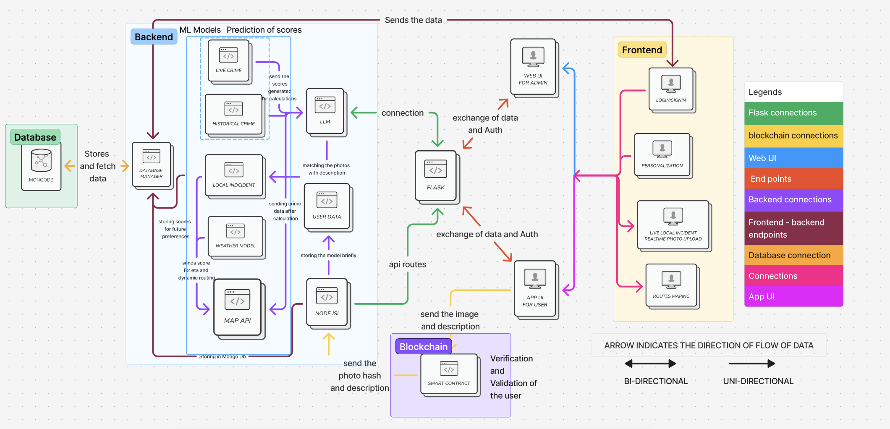

## System Architecture

# GoSafe AI

GoSafe AI - Your Intelligent Travel Safety Companion 🚀

🔥 Revolutionizing Travel Safety with AI

GoSafe AI is an advanced, AI-powered travel safety system designed to analyze, predict, and alert travelers about potential risks in real time. Whether you're commuting in your city or backpacking across the world, GoSafe AI ensures you stay safe, informed, and prepared for any situation.

## Demo

Youtube Link:https://youtube.com/shorts/kkSd2QtgcMg?feature=share

## ⚡ Key Features
🌍 Real-Time Safety Insights

Get live safety scores for any location based on crime rates, accidents, and environmental hazards.

AI-driven risk analysis with real-time updates from official sources and local reports.

Heatmaps for high-risk zones, safe areas, and alternative routes.

📡 AI-Powered Incident Detection

Smart AI monitoring of news, social media, and government alerts to detect potential threats (e.g., protests, natural disasters, or criminal activities).

Immediate notifications about emerging risks around your location.

Predictive modeling to forecast future safety conditions based on historical data.

🚀 Personalized Safety Recommendations

Tailored alerts based on your location, time of travel, and personal risk preferences.

Safe route suggestions using AI-driven path optimization.

Alternative travel options in case of disruptions or dangerous conditions.

🛰 Emergency Assistance & SOS Feature

One-tap emergency SOS button to alert local authorities and emergency contacts.

Instant access to nearby hospitals, police stations, and embassies.

AI-powered chatbot for quick emergency guidance and response instructions.

🛡 Community-Driven Safety Insights

User-generated safety reports to help others avoid risks.

Verified local guides and travelers sharing real-time updates.

AI-driven credibility scoring to ensure trustworthy safety reports.

🔗 Seamless Integration & Multi-Platform Access

Available on mobile, web, and wearable devices.

Integrates with Google Maps, Apple Maps, and ride-hailing services.

API access for travel agencies, businesses, and emergency services.
## 🛠 Tech Stack
Frontend: React.js, Next.js, TailwindCSS

Backend: Node.js, Express.js, Firebase

AI/ML: Python, TensorFlow, OpenAI, Scikit-Learn

Database: MongoDB, PostgreSQL

APIs & Integrations: Google Maps API, OpenWeather API, Twilio for SOS Alerts
## 🎯 Why Choose GoSafe AI?

✅ AI-Powered Intelligence – Smart predictions and real-time insights for unparalleled safety.
✅ User-Friendly & Accessible – Designed for travelers, locals, and emergency responders alike.
✅ Global & Scalable – Works in any location with multilingual support.
✅ Privacy-Focused – Secure data encryption and anonymous reporting.
##   🚀 Join Us

🚀 Join the Future of Safe Traveling!

GoSafe AI is more than an app—it's a movement towards smarter, safer, and stress-free travel. Whether you're a solo traveler, daily commuter, or an explorer at heart, GoSafe AI has your back!

👉 Try it now and experience the future of travel safety!

📩 For collaborations or inquiries, contact us at: sakshigolatkar2486@gmail.com 
